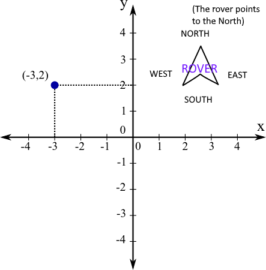

# Mars Rover
#### How to Run the program
For running the script, is sufficient to cd in the /src folder of the project, and launch:
> node main.js

I have tested the code with node v10.16.0 .
#### What route to call for passing the commands to the Rover?
The route to call is the following?
> http://{ipaddress}:{port}/parseCommands

For example, with the defaults parameters in the configuration:
> http://localhost:3005/parseCommands
#### How to this route?
You have to pass an array parameter, with a javascript-like array as a parameter.
An example:
>http://localhost:3005/parseCommands?array=["GoFrontCommand","GoLeftCommand"]
#### What commands are supported?
These is the list of the supported commands( they are char-sensitive! ):
> - GoFrontCommand 
> - GoBackCommand 
> - GoLeftCommand 
> - GoRightCommand
> - GoRotateClockwiseCommand
> - GoRotateReverseClockwiseCommand

#### Reference system used in the program
This program uses this type of system reference:

All the movements made by the rover (front, left, rotations) are made based on his point of view.
For example:
>If the Rover is pointing at NORTH, and it wants to make a LEFT movement, it will move by -1 pixel at its left(its left means
effectively x= x MINUS 1 for our system of reference).

>If the Rover is pointing at SOUTH, and it wants to make a LEFT movement, it will move by -1 pixel at its left(its left means
effectively x= x PLUS 1 for our system of reference).

